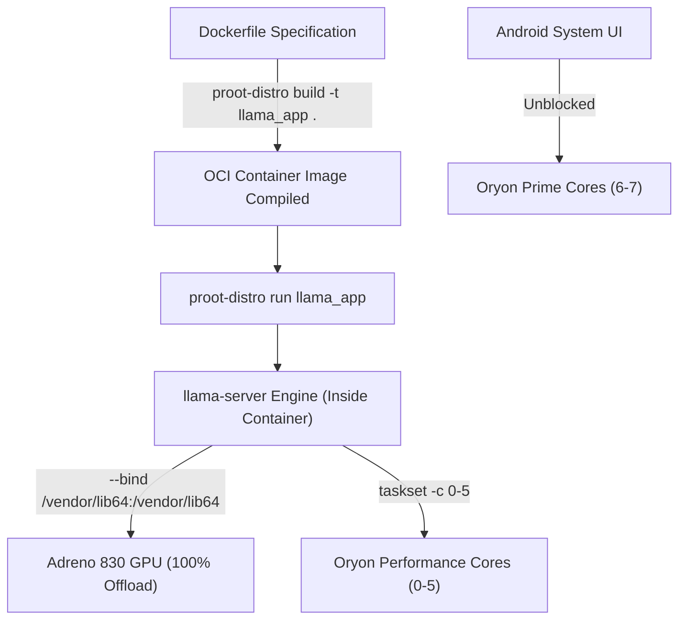

# 📱 llama-android-container

> **Native OCI Dockerfile Compilation & High-Performance Thermal Optimization for Android Termux**  
> Powered by **`proot-distro build`** (Rootless Dockerfile Compiler) & **Qualcomm Adreno 830 GPU** (OpenCL Acceleration).

---

## ⚡ 1-Line Installation (Modern One-Liner)

Install everything automatically on Termux with a single command (no repository cloning required):

```bash
curl -fsSL https://raw.githubusercontent.com/mateusoro/llama-android-container/main/install.sh | bash
```

After installation completes, start the server anywhere by typing:

```bash
llama-container
```

---

## ⚡ Architecture: Native Rootless Dockerfile Build

This project uses **`proot-distro build`** (`pd build`), the native OCI Dockerfile compiler built into Termux that compiles Dockerfiles rootlessly without requiring a Docker daemon.



---

## 📄 Dockerfile Specification

The container is compiled directly from a standard `Dockerfile`:

```dockerfile
FROM ubuntu:latest

# 1. Single HuggingFace Repository ID Variable
ENV REPO_ID=InternScience/Agents-A1-4B-Q4_K_M-GGUF

# 2. Hardware & OpenCL Adreno 830 GPU Driver Path
ENV LD_LIBRARY_PATH=/vendor/lib64

# 3. LLM Inference Parameters
ENV CONTEXT=32768
ENV THREADS=3
ENV UBATCH=128
ENV BATCH=512
ENV GPU_LAYERS=99
ENV FLASH_ATTN=on
ENV PORT=8085
ENV HOST=0.0.0.0

# 4. Build-time setup inside container
RUN apt-get update && apt-get install -y curl ca-certificates
```

---

## 📊 Benchmark Summary

| Metric | Stock / Default Settings | Dockerfile OCI Build Mode (`llama-android-container`) |
| :--- | :--- | :--- |
| **CPU Temperature** | **102.3 °C** 🛑 (Thermal Throttling) | **58.3 °C – 67.5 °C** 🧊 (**-34.8 °C Drop!**) |
| **Generation Speed** | ~11.5 tokens/s | **14.37 – 16.22 tokens/s** 🏆 (Peak Performance) |
| **Prefill UI Lag** | Severe UI Freezing | **Smooth & Fluid** (`-ub 128` Micro-batching) |
| **GPU Acceleration** | 100% Adreno 830 Offload | **100% OpenCL Passthrough via Container** |
| **Dockerfile Compilation** | Manual | **Native Rootless OCI Build (`proot-distro build`)** |

---

## 🚀 Quick Start & Usage

### 1. Compile & Start Server via Default Dockerfile
```bash
llama-container
```

### 2. Compile & Start Server via Custom Dockerfile
```bash
llama-container meu_modelo.Dockerfile
```
or
```bash
proot-distro build -f meu_modelo.Dockerfile -t meu_app --install-as meu_app .
```

The startup script automatically:
1. Compiles the target `Dockerfile` into a rootless OCI container via `proot-distro build`
2. Resolves and downloads model weights from HuggingFace
3. Terminates old server instances to prevent OOM memory kills
4. Launches real-time 15s thermal logger (`~/bottleneck.log`)
5. Executes `llama-server` **inside the GPU-accelerated container** on port `8085`
6. Performs an automatic health check and warmup request

---

## 🌡️ Real-Time Bottleneck & Thermal Monitoring

Monitor temperatures, CPU load, and RAM usage live:

```bash
tail -f ~/bottleneck.log
```

---

## 📄 License

Distributed under the MIT License. Free for personal and commercial use.
