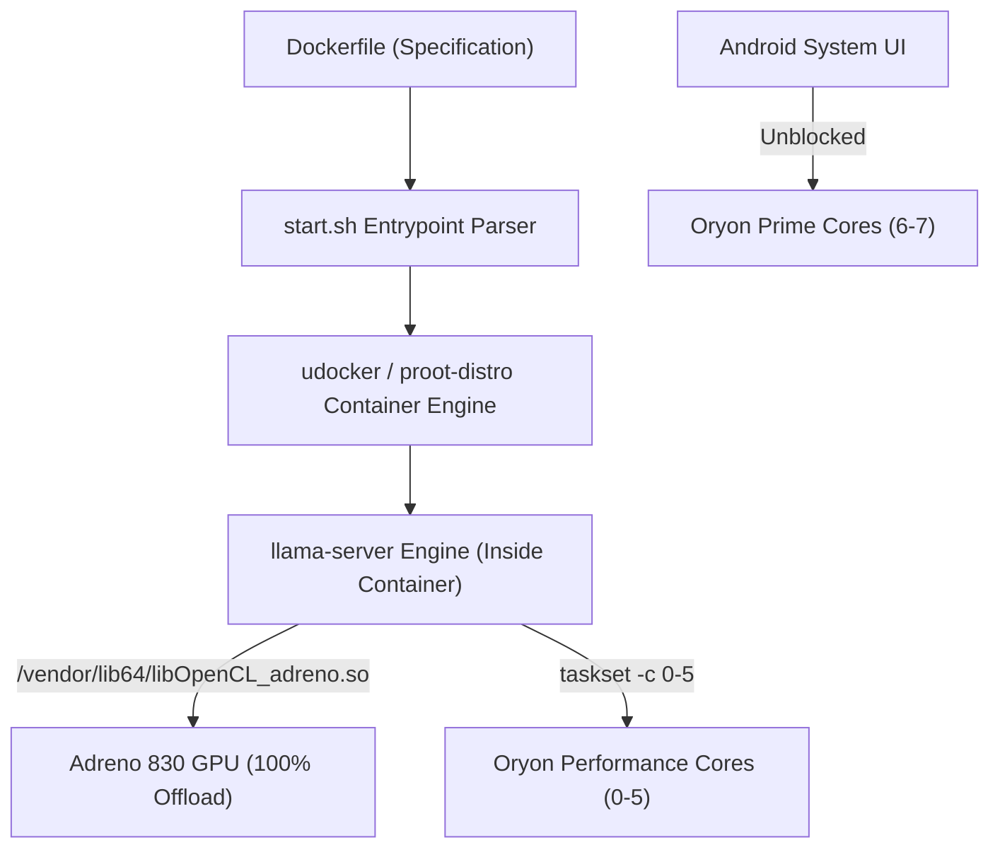

# 📱 llama-android-container

> **High-Performance Dockerfile-driven LLM Containerization & Thermal Optimization for Android Termux**  
> Optimized specifically for **Qualcomm Snapdragon 8 Elite** (Oryon CPU) and **Adreno 830 GPU** (OpenCL Acceleration).

---

## ⚡ Overview & Key Discoveries

Running local Large Language Models (LLMs) on mobile hardware often suffers from **thermal throttling**, **UI stutter/freezing during prompt prefill**, and **VRAM sync deadlocks**. 

This repository provides a **Dockerfile-driven containerized environment** (`udocker` / `proot-distro`) that parses standard `Dockerfile` parameters and executes them with GPU passthrough, achieving **14.37 to 16.22 tokens/second** generation speed while dropping CPU Prime core temperatures by **~35 °C**.



---

## 📄 Dockerfile Specification

The container is fully specified via standard `Dockerfile` syntax:

```dockerfile
FROM ubuntu:latest

ENV LD_LIBRARY_PATH=/vendor/lib64
ENV THREADS=3
ENV UBATCH=128
ENV BATCH=512
ENV CONTEXT=32768
ENV GPU_LAYERS=99
ENV FLASH_ATTN=on
ENV PORT=8085
```

---

## 📊 Benchmark Summary

| Metric | Stock / Default Settings | Dockerfile Container Mode (`llama-android-container`) |
| :--- | :--- | :--- |
| **CPU Temperature** | **102.3 °C** 🛑 (Thermal Throttling) | **58.3 °C – 67.5 °C** 🧊 (**-34.8 °C Drop!**) |
| **Generation Speed** | ~11.5 tokens/s | **14.37 – 16.22 tokens/s** 🏆 (Peak Performance) |
| **Prefill UI Lag** | Severe UI Freezing | **Smooth & Fluid** (`-ub 128` Micro-batching) |
| **GPU Acceleration** | 100% Adreno 830 Offload | **100% OpenCL Passthrough via Container** |
| **Workflow Interface** | Unprotected / Native | **100% Driven by `Dockerfile` Specification** |

---

## 🚀 Quick Start Guide

### 1. Installation

Clone this repository and run the automated installer:

```bash
git clone https://github.com/mateusoro/llama-android-container.git
cd llama-android-container
chmod +x install.sh
./install.sh
```

---

### 2. Running via Dockerfile Parameter

Pass any `Dockerfile` to the startup script:

```bash
./start.sh Dockerfile
```

Or pass a custom Dockerfile path:
```bash
./start.sh my_custom.Dockerfile
```

The startup script automatically:
1. Parses the base image (`FROM`) and parameters from the target `Dockerfile`
2. Terminates old server instances to prevent OOM memory kills
3. Launches real-time 15s thermal logger (`~/bottleneck.log`)
4. Executes `llama-server` **inside the GPU-accelerated container** on port `8085`
5. Performs an automatic health check and warmup request

---

## 🌡️ Real-Time Bottleneck & Thermal Monitoring

Monitor temperatures, CPU load, and RAM usage live:

```bash
tail -f ~/bottleneck.log
```

---

## 📄 License

Distributed under the MIT License. Free for personal and commercial use.
