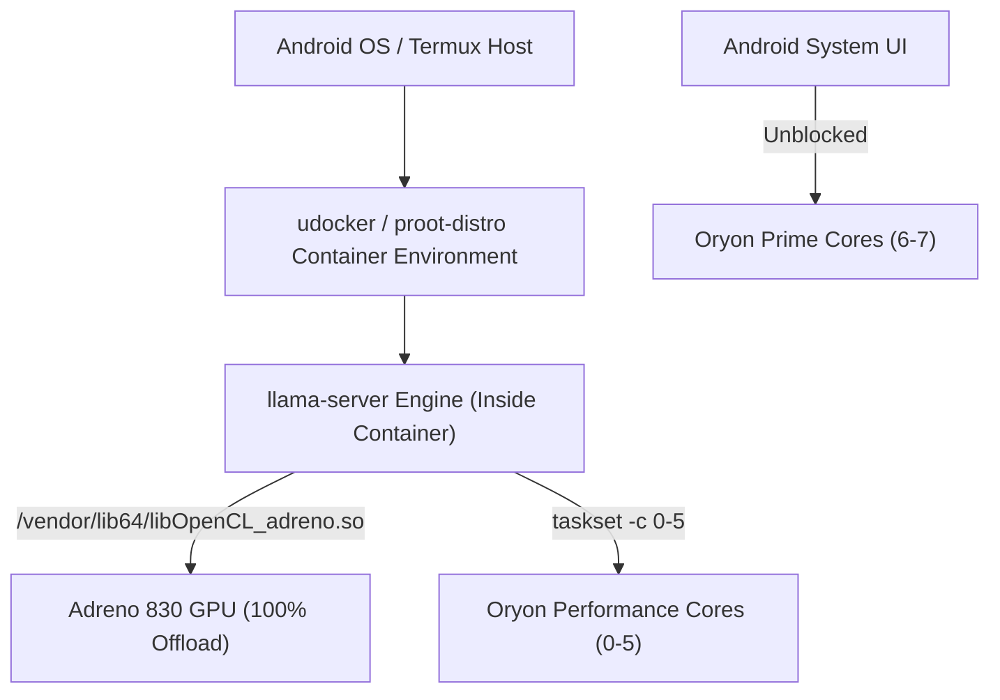

# 📱 llama-android-container

> **High-Performance LLM Containerization & Thermal Optimization for Android Termux**  
> Optimized specifically for **Qualcomm Snapdragon 8 Elite** (Oryon CPU) and **Adreno 830 GPU** (OpenCL Acceleration).

---

## ⚡ Overview & Key Discoveries

Running local Large Language Models (LLMs) on mobile hardware often suffers from **thermal throttling**, **UI stutter/freezing during prompt prefill**, and **VRAM sync deadlocks**. 

This repository provides a **100% containerized environment** (`udocker` / `proot-distro`) that solves these mobile bottlenecks, achieving **14.37 to 16.22 tokens/second** generation speed while dropping CPU Prime core temperatures by **~35 °C**.



---

## 📊 Benchmark Summary

| Metric | Stock / Default Settings | Container Mode (`llama-android-container`) |
| :--- | :--- | :--- |
| **CPU Temperature** | **102.3 °C** 🛑 (Thermal Throttling) | **58.3 °C – 67.5 °C** 🧊 (**-34.8 °C Drop!**) |
| **Generation Speed** | ~11.5 tokens/s | **14.37 – 16.22 tokens/s** 🏆 (Peak Performance) |
| **Prefill UI Lag** | Severe UI Freezing | **Smooth & Fluid** (`-ub 128` Micro-batching) |
| **GPU Acceleration** | 100% Adreno 830 Offload | **100% OpenCL Passthrough via Container** |
| **Execution Environment** | Unprotected / Native | **100% Isolated Container (`udocker` / `proot-distro`)** |

---

## 🛠️ Key Technical Optimizations

> [!NOTE]
> **1. CPU Core Pinning (`taskset -c 0-5`)**  
> The Snapdragon 8 Elite features 2 ultra-hot Prime cores and 6 Performance cores. By hard-pinning `llama-server` to cores `0-5`, we isolate the Prime cores for Android system UI rendering and eliminate thermal throttling.

> [!TIP]
> **2. Micro-Batching (`-ub 128`)**  
> Default logical batch sizes (`-ub 512`) monopolize the GPU command queue for 500ms+ per kernel submission, causing UI frame drops. Slicing prefill into 128-token micro-batches yields the GPU queue back to the Android display compositor between iterations.

> [!IMPORTANT]
> **3. Flash Attention (`-fa on`) & Standard KV Cache (`f16`)**  
> Pass `-fa on` for FlashAttention 2 acceleration. **Do NOT quantize KV cache** (`-ctk q4_0 -ctv q4_0`) on Adreno OpenCL drivers, as quantized KV cache causes `SET_ROWS` sync kernel crashes.

---

## 🚀 Quick Start Guide

### 1. Installation

Clone this repository and run the automated installer:

```bash
git clone https://github.com/mateusoro/llama-android-container.git
cd llama-android-container
chmod +x install.sh
./install.sh
```

---

### 2. Running the Container Server

Start the containerized server directly:

```bash
./start.sh
```

Or specify a custom container image name:
```bash
./start.sh llm_agent
```

The startup script automatically:
1. Terminates old server instances to prevent OOM memory kills
2. Launches real-time 15s thermal logger (`~/bottleneck.log`)
3. Executes `llama-server` **exclusively inside the container** on port `8085` with GPU OpenCL passthrough
4. Performs an automatic health check and warmup request

---

## 🌡️ Real-Time Bottleneck & Thermal Monitoring

Monitor temperatures, CPU load, and RAM usage live:

```bash
tail -f ~/bottleneck.log
```

---

## 📄 License

Distributed under the MIT License. Free for personal and commercial use.
